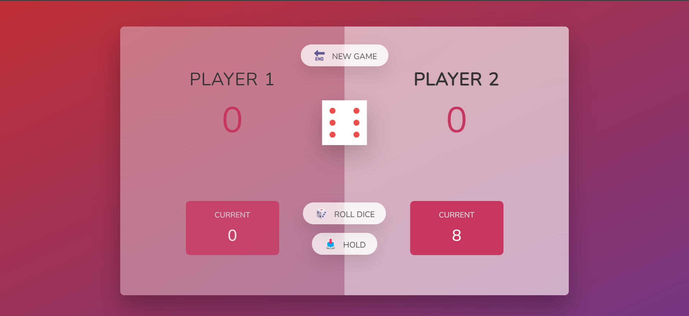

# Pig-game 🎮

The pig game is a two player board game.

## GAME RULES:

* The game has 2 players, each taking their turn
* On each turn, a player rolls a dice as many times as he wishes. Each result is added to its `ROUND` score .
* BUT, if the player rolls the dice and rolls a 1, his `ROUND` score is lost. After that it's the next player's turn
* The player can choose 'Hold', which means their `ROUND` is added to the` GLOBAL` score . After that, it's the next player's turn.


## How to win:
* The first player to reach 100 points on `GLOBAL` wins the game.

## Quick start

Clone the Project

```bash
git clone https://github.com/Ahmedashref26/Pig-Game.git
```

---

[](main.png)

## Flow Chart

[](pig-game-flowchart.png)

---

## License

MIT
